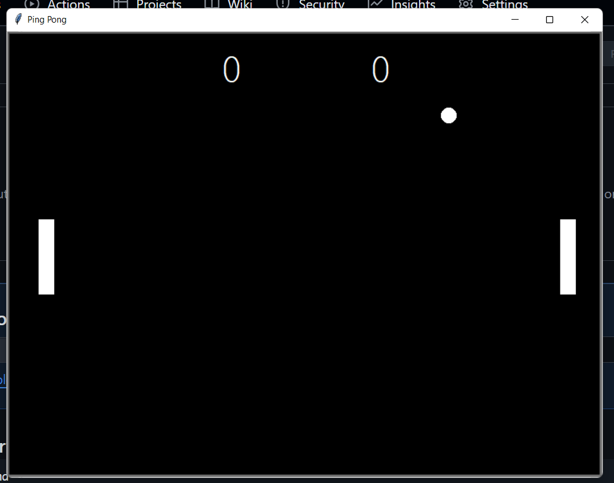

```markdown
# Ping Pong Game

A simple Ping Pong game built using Python's `turtle` module. This game includes two paddles controlled by players, a bouncing ball, and a scoreboard. Each time the ball passes a paddle, the opposing player scores a point. 

## Features

- Player controls for both paddles
- Score tracking for each player
- Bouncing mechanics for ball and paddle collisions
- Adjustable game speed for each hit to increase difficulty
- Game reset functionality when a player misses

## Installation

1. Clone the repository:
   ```bash
   git clone https://github.com/Mukulmw/Pong_game.git
   ```
2. Navigate into the directory:
   ```bash
   cd Pong_game
   ```

## Usage

1. Run the game:
   ```bash
   python main.py
   ```
   
2. **Player Controls**:
   - **Right Paddle**:
     - Move Up: `Up Arrow`
     - Move Down: `Down Arrow`
   - **Left Paddle**:
     - Move Up: `W`
     - Move Down: `S`

3. **Gameplay**:
   - Each player scores a point when the ball passes the opposing paddle.
   - The game speed increases slightly with each paddle hit, adding difficulty.
   - The game resets the ball to the center after a player scores.

## Code Structure

- **`main.py`**: Initializes the game screen, paddles, ball, and scoreboard. Handles key bindings and main game loop.
- **`paddle.py`**: Contains the `Paddle` class to create and control paddle objects.
- **`ball.py`**: Contains the `Ball` class to manage the ball's movement, including bouncing logic.
- **`scoreboard.py`**: Contains the `Scoreboard` class to keep track of each player's score and display it on the screen.

## Screenshots



```